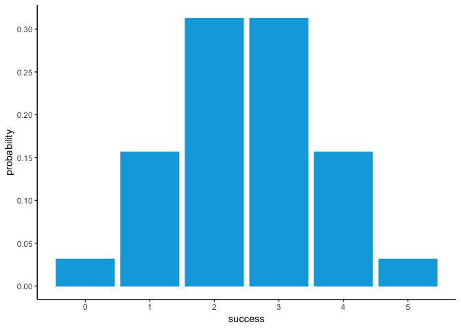
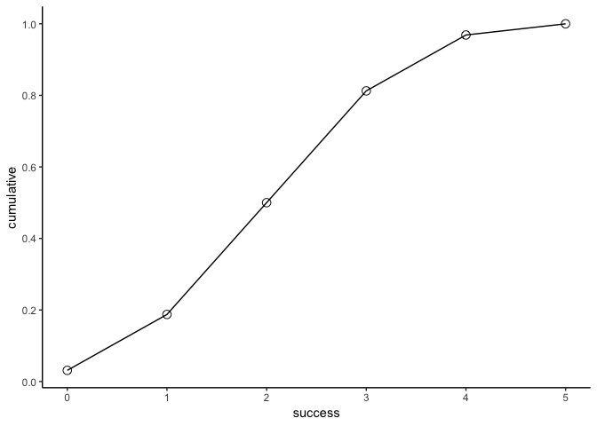

Overview
--------

The package `"binomial"` is an [R](http://www.r-project.org/) package that implements functions for calculating probabilities of a Binomial random variable.

-   `bin_choose()` Calculates the number of combinations in which *k* successes can occur in *n* trials.
-   `bin_probability()` Calculates the probability of gatting *k* successes in *n* trails with *prob* of success.
-   `bin_distribution()` Return a data frame with the probability distribution: *sucesses* in the first column, *probability* in the second column.
-   `plot()` Method that graphs a barplot to display the probability histogram of a binomial distribution.
-   `bin_cumulative()` Takes two arguments *trials* and *prob* that a binomial random variable object "binvar".
-   `plot()` Method to graph the cumulative distribution.
-   `print.summary.binvar()` Method to nicely print the contents of an object "summary.binvar"
-   `bin_mean()` Calculate the mean (expected value) of a binomial variable
-   `bin_variance()` Calculate the variance of a binomial variable.
-   `bin_mode()` Calculate the mode of a binomial variable.
-   `bin_skewness()` Calculate the skewness of a binomial variable.
-   `bin_kurtosis()` Calculate the kurtosis (tailedness) of a binomial variable.

Motivation
----------

This package has been developed to provide tools for calculating probabilties of binomial random variables.

Installation
------------

Install the development version from GitHub via the package `"devtools"`:

``` r
# development version from GitHub:
install.packages("devtools") 
# install "binomial" (without vignettes)
devtools::install_github("stat133-sp19/hw-stat133-YuniSatoshi/binomial")
# install "binomial" (with vignettes)
devtools::install_github("stat133-sp19/hw-stat133-YuniSatoshi/binomial", build_vignettes = TRUE)
```

Usage
-----

``` r
library(binomial)
library(ggplot2)
#> Warning: package 'ggplot2' was built under R version 3.4.4

# For instance
# the number of combinations in which k = 2 successes can occur in n = 5 trials is
bin_choose(5, 2)
#> [1] 10
# the probability of getting 2 successes in 5 trials, assuming prob of success = 0.5 is
bin_probability(2, 5, 0.5)
#> [1] 0.3125
# graph a barplot to display the probability histogram of a binomial distribution   
dis1 <- bin_distribution(5, 0.5) 
#> Warning in if (success > trials) {: the condition has length > 1 and only
#> the first element will be used
#> Warning in if (success < 0) {: the condition has length > 1 and only the
#> first element will be used
#> Warning in if (success > trials) {: the condition has length > 1 and only
#> the first element will be used
plot(dis1)
```



``` r
# return a data frame with both the probability distribution and the cumulative probabilities
bin_cumulative( 5,  0.5)
#> Warning in if (success > trials) {: the condition has length > 1 and only
#> the first element will be used
#> Warning in if (success < 0) {: the condition has length > 1 and only the
#> first element will be used
#> Warning in if (success > trials) {: the condition has length > 1 and only
#> the first element will be used
#>   success probability cumulative
#> 1       0     0.03125    0.03125
#> 2       1     0.15625    0.18750
#> 3       2     0.31250    0.50000
#> 4       3     0.31250    0.81250
#> 5       4     0.15625    0.96875
#> 6       5     0.03125    1.00000
# graph the cumulative distribution
dis2 <- bin_cumulative(5, 0.5) 
#> Warning in if (success > trials) {: the condition has length > 1 and only
#> the first element will be used
#> Warning in if (success < 0) {: the condition has length > 1 and only the
#> first element will be used
#> Warning in if (success > trials) {: the condition has length > 1 and only
#> the first element will be used
plot(dis2)
```



``` r
# nicely print the content of the object "binvar"
bin1 <- bin_variable(10, 0.3) 
bin1
#> "Binomial variable"
#> 
#> Parameters
#> - number of trials: 10 
#> - prob of success : 0.3
# print the contents of an object "summary.binvar"
bin1 <- bin_variable(10, 0.3) 
binsum1 <- summary(bin1)
binsum1
#> "Summary Binomial"
#> 
#> Parameters
#> - number of trials: 10 
#> - prob of success : 0.3 
#> 
#> Measures
#> - mean    : 3 
#> - variance: 2.1 
#> - mode    : 3 
#> - skewness: 0.2760262 
#> - kurtosis: -0.1238095
# functions of measures
bin_mean(10,0.3)
#> [1] 3
bin_variance(10, 0.3)
#> [1] 2.1
bin_mode(10, 0.3)
#> [1] 3
bin_skewness(10, 0.3)
#> [1] 0.2760262
bin_kurtosis(10, 0.3)
#> [1] -0.1238095
```
